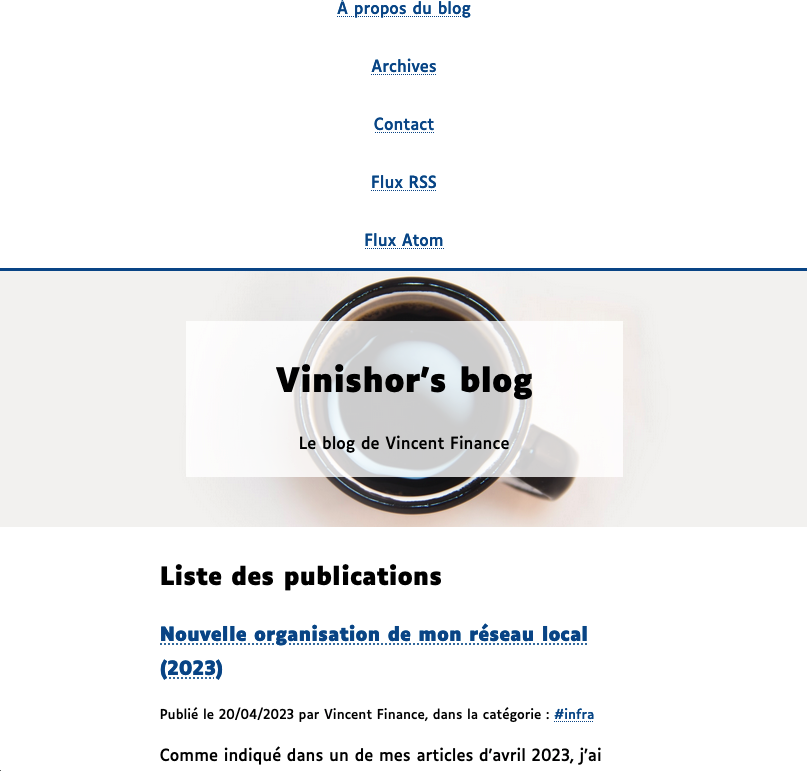

# BasicMario

## French

Un thème simple, mais fonctionnel pour mon blog

Ce thème fonctionne avec la dernière version de [Pelican](https://blog.getpelican.com/) (testé sous Ubuntu 20.04) et ne nécessite pas de dépendances particulières.  
Il est responsive et fonctionne sur la plupart des équipements pouvant afficher un site web (liseuses d'ebooks, tablettes, smartphones, PC, TVs). Il inclut un script JavaScript qui sert uniquement à activer le mode jour/nuit en chargeant une classe dédiée.

## English

A simple, but yet practical theme for my blog

This theme uses latest version of [Pelican](https://blog.getpelican.com/) (tested on Ubuntu 20.04) and it doesn't any dependencies to work.  
It's a reponsive theme and it works almost all of web-capable devices (e-books readers, tablets, smartphones, computers and TVs). It includes a JavaScript script to activate the night/day switch by loading a special CSS class.

## Screenshots

### Version normale / Normal version

### Version mobile / Mobile version

### Version en mode nuit / Night-mode version

## Licence / License

Licence du projet / Project's license : [BSD 2-Clause](LICENSE.md)

### Notes addtionnelles / Extra notes

Script JavaScript : basé sur le travail de prx@ybad.name (CC BY 4.0) / JavaScript script : based on the work of prx@ybad.name
